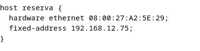

# Indice

[1. INTRODUCCION](#introduccion)

[2. Actualizar sistema](#actualizar-sistema)

[3. Configuración de red del equipo](#configuracion-de-red-del-equipo)

[4. Instalacion del servidor](#instalacion-del-servidor)

[5. Configuracion del servidor](#configuracion-del-servidor)

[6. Configuracion interfaz de red](#configuracion-interfaz-de-red)

[7. Ultimos pasos](#reiniciar-el-servidor)

[8. Ejemplo practico](#cliente-w10)

# INTRODUCCION
En este documento instalaremos un servidor DHCP en Debian. El nombre de software es _isc-dhcp-server_. Y vamos a desarrollar un ejemplo en paralelo para ilustrar la explicacion.

El diagrama de la red es el siguiente:

# Actualizar sistema
    sudo apt update
    sudo apt upgrade

#   CONFIGURACION DE RED DEL EQUIPO
 El equipo deberá de tener configurada una IP estatica, la cual habremos configurado previamente

Para verifcar que la configuracion es correcta usaremos el comando __ip addr__. Ademas deberemos de anotar __el nombre de la interfaz de red__ ya que la utilizaremos mas tarde.

    ip address
 
# INSTALACION DEL SERVIDOR
Utilizaremos el comando apt para instalar el servidor DHCP en Debian

    sudo apt install isc-dhcp-server

# CONFIGURACION DEL SERVIDOR
Una vez que el servidor DHCP esté instalado, debes configurarlo para que se adapte a tus necesidades. La configuración principal se encuentra en el archivo /etc/dhcp/dhcpd.conf.

    sudo nano /etc/dhcp/dhcpd.conf

Me aseguro de personalizar esta configuración según las necesidades de mi red, como la dirección IP de mi enrutador (option routers) y el rango de direcciones IP a asignar (range), el lease time que es el tiempo que le mantiene el servidor la IP, hay un minimo y un máximo por si el cliente viene con un lease time por defecto que no interfiera.

## _Reservar una IP_

Para reservar una ip bajaremos un poco en el fichero de configuración, mas abajo encontraremos lo siguiente:

Nos lo encontraremos comentado, le quitamos las almohadillas y en host al lado ponemos un nombre no importa cual es un identificativo, dentro de los corchetes tenemos hardware ethernet en la cual pondremos la MAC del equipo que queremos reservar dicha IP

Y en fixed address pondremos la IP que queremos reservar

En mi caso en el cliente Windows esa es su direccion física correspondiente y le voy a reservar la IP 192.168.12.75 por ejemplo

## _Excluir una IP_

Para llevar acabo la exclusion de una IP deberemos de volver arriba donde configuramos los parametros principales del servidor DHCP, añadiremos una directiva en la cual ponga deny seguido de la IP que queremos excluir.

# CONFIGURACION INTERFAZ DE RED

Debes especificar la interfaz de red en la que el servidor DHCP escuchará las solicitudes. Esto se hace en el archivo /etc/default/isc-dhcp-server.

    sudo nano /etc/default/isc-dhcp-server

Asegúrate de que la línea INTERFACESv4="" esté configurada para usar la interfaz de red correcta. Por ejemplo, en mi caso como enseñe en la _CONFIGURACION DE RED DEL EQUIPO_ deberia ser enp0s3, debería verse así:

    INTERFACESv4="enp0s3"

# REINICIAR EL SERVIDOR

Para que se apliquen todos los cambios que hemos realizado en los pasos anteriores deberemos reiniciar el servidor con el siguiente comando.

    sudo systemctl restart isc-dhcp-server

# HABILITAR EL INICIO AUTOMATICO

Para asegurarte de que el servidor DHCP se inicie automáticamente en el arranque, ejecuta el siguiente comando:

    sudo systemctl enable isc-dhcp-server

# VERIFICAR ESTADO DEL SERVIDOR DHCP

Puedes verificar si el servidor DHCP está funcionando correctamente ejecutando:

    sudo systemctl status isc-dhcp-server

Deberías ver un mensaje que indique que el servidor está activo y en funcionamiento.

 Ahora, cualquier dispositivo que se este en la red local debería recibir una dirección IP automáticamente desde el servidor DHCP. 

# LOGS

Con el comando journalctl -u isc-dhcp-server.service es un log en el cual te salen los fallos en el servicio que pongamos despues de -u pondremos el servicio del que queremos que nos saque el log, en este caso es el servidor DHCP pero podria ser cualquier otro servicio.

# EJEMPLO DE ASIGNACIÓN DE IP´S

## Cliente W10

En este caso nos ha asignado la IP que habiamos guardado para este equipo mediante la MAC.

## Cliente Linux

La configuracion esta correcta me ha asignado la IP 192.168.12.50 que es la primera
